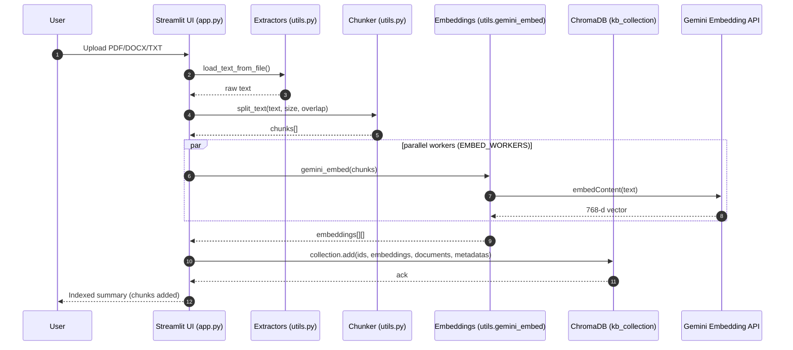
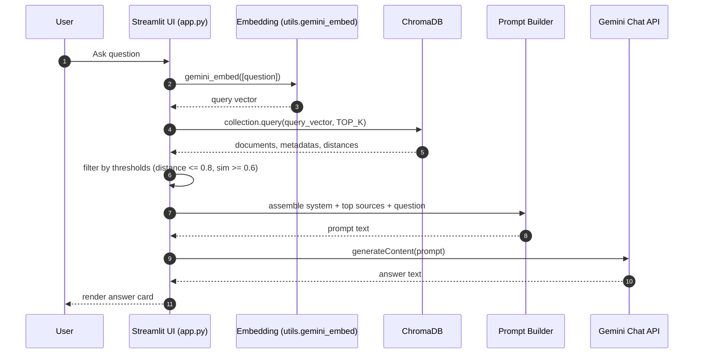
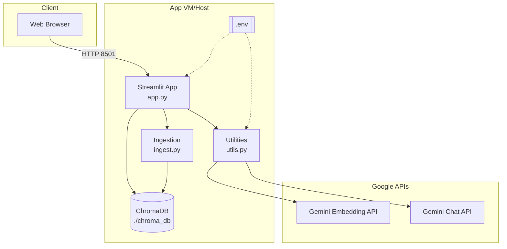

# KNOWLEDGE BASE RAG AGENT - ARCHITECTURE DIAGRAM

Below are Mermaid diagrams that you can view natively on GitHub. They complement the ASCII diagram and focus on the end‑to‑end flow, detailed sequences, and deployment view.

## System Overview

```mermaid
flowchart LR
        U[User (Browser)] -->|HTTP| S[Streamlit UI\napp.py]
        subgraph Indexing
                S -->|Upload| X[Extract Text\n(pdfplumber / python-docx / txt)]
                X --> Ck[Chunking\nCHUNK_SIZE & OVERLAP]
                Ck --> E((Embeddings))
                E -->|gemini text-embedding-004| G1[(Gemini Embedding API)]
                E -->|Vectors| DB[(ChromaDB\nPersistentClient)]
        end

        subgraph Retrieval+Generation
                S --> Q[User Question]
                Q --> QE[Query Embedding]
                QE -->|gemini text-embedding-004| G1
                QE --> DB
                DB --> R[Top-K Relevant Chunks]
                R --> P[Prompt Assembly\n(system + sources + question)]
                P -->|gemini 2.0 flash| G2[(Gemini Chat API)]
                G2 --> A[Answer]
                A --> S
        end

        subgraph Config
                Env[[.env\nGEMINI_API_KEY]]
                Vars[[Env overrides\nCHUNK_SIZE\nCHUNK_OVERLAP\nEMBED_WORKERS]]
        end
        Env -.-> S
        Vars -.-> S
```

## Sequence: Document Ingestion



## Sequence: Question Answering



## Deployment / Container View (C4‑style)




```
┌─────────────────────────────────────────────────────────────────────────────┐
│                         USER INTERACTION LAYER                              │
│                                                                             │
│  ┌──────────────────────────────────────────────────────────────────────┐  │
│  │                     STREAMLIT WEB UI (app.py)                        │  │
│  │                                                                      │  │
│  │  ┌──────────────┐  ┌──────────────┐  ┌────────────────────────┐   │  │
│  │  │   Question   │  │  Upload      │  │  Clear Database        │   │  │
│  │  │   Input      │  │  Documents   │  │  Button                │   │  │
│  │  └──────┬───────┘  └──────┬───────┘  └───────┬────────────────┘   │  │
│  │         │                  │                  │                     │  │
│  │         ▼                  ▼                  ▼                     │  │
│  │  ┌────────────────────────────────────────────────────────┐        │  │
│  │  │          Answer Display + Source Snippets              │        │  │
│  │  │  • AI-Generated Response                               │        │  │
│  │  │  • Top 3 Source Chunks with Similarity Scores          │        │  │
│  │  │  • Document Names and Chunk IDs                        │        │  │
│  │  └────────────────────────────────────────────────────────┘        │  │
│  └──────────────────────────────────────────────────────────────────────┘  │
└─────────────────────────────────────────────────────────────────────────────┘
                                    │
                    ┌───────────────┴───────────────┐
                    ▼                               ▼
┌─────────────────────────────────┐   ┌─────────────────────────────────┐
│   INGESTION PIPELINE            │   │   QUERY PIPELINE                │
│   (ingest.py)                   │   │   (app.py → utils.py)           │
│                                 │   │                                 │
│  1. Load Documents              │   │  1. User Query                  │
│     ├─ PDF (pdfplumber)         │   │     └─ "What is AI?"            │
│     ├─ DOCX (python-docx)       │   │                                 │
│     └─ TXT (plain text)         │   │  2. Generate Query Embedding    │
│                                 │   │     └─ gemini_embed([query])    │
│  2. Split into Chunks           │   │        ↓                        │
│     ├─ Size: 800 chars          │   │     [0.12, 0.45, ..., 0.89]    │
│     └─ Overlap: 100 chars       │   │        (768 dimensions)         │
│                                 │   │                                 │
│  3. Generate Embeddings         │   │  3. Vector Search               │
│     └─ gemini_embed(chunks)     │   │     └─ collection.query()       │
│        ↓                        │   │        ↓                        │
│     [[0.1, 0.4, ...], ...]      │   │     Top 5 chunks by cosine     │
│     (768-d vectors)             │   │        similarity               │
│                                 │   │                                 │
│  4. Store in ChromaDB           │   │  4. Filter by Threshold         │
│     └─ Upsert to collection     │   │     ├─ Distance ≤ 0.8           │
│                                 │   │     └─ Similarity ≥ 60%         │
└─────────────┬───────────────────┘   │                                 │
              │                       │  5. Build Prompt                │
              │                       │     ├─ System Instruction        │
              │                       │     ├─ Top 3 Source Chunks       │
              ▼                       │     └─ User Question             │
┌─────────────────────────────────┐   │                                 │
│   VECTOR DATABASE               │   │  6. Call LLM API                │
│   (ChromaDB - ./chroma_db/)     │◄──┤     └─ gemini_chat()            │
│                                 │   │        ↓                        │
│  Collection: kb_collection      │   │     Generated Answer            │
│  Metric: Cosine Similarity      │   │                                 │
│                                 │   │  7. Return Response             │
│  Stored Data:                   │   │     ├─ Answer text              │
│  ┌────────────────────────────┐ │   │     └─ Source citations         │
│  │ ID: "doc.pdf__0"           │ │   └─────────────────────────────────┘
│  │ Embedding: [768 floats]    │ │
│  │ Document: "chunk text..."  │ │
│  │ Metadata:                  │ │
│  │   - source: "doc.pdf"      │ │
│  │   - chunk_id: "doc.pdf__0" │ │
│  │   - text_preview: "..."    │ │
│  └────────────────────────────┘ │
└─────────────────────────────────┘
              │
              ▼
┌─────────────────────────────────────────────────────────────────────┐
│                     EXTERNAL API LAYER                              │
│                                                                     │
│  ┌────────────────────────────┐   ┌────────────────────────────┐  │
│  │   GEMINI EMBEDDING API     │   │   GEMINI CHAT API          │  │
│  │   (utils.py)               │   │   (utils.py)               │  │
│  │                            │   │                            │  │
│  │  Model: text-embedding-004 │   │  Model: gemini-2.0-flash   │  │
│  │  Output: 768-d vectors     │   │  Temperature: 0.0          │  │
│  │  Batch: 100 texts max      │   │  Max Tokens: 2048          │  │
│  │  Retry: 3 attempts         │   │  Retry: 3 attempts         │  │
│  │  Backoff: Exponential      │   │  Backoff: Exponential      │  │
│  │                            │   │                            │  │
│  │  Endpoint:                 │   │  Endpoint:                 │  │
│  │  generativelanguage.       │   │  generativelanguage.       │  │
│  │  googleapis.com            │   │  googleapis.com            │  │
│  └────────────────────────────┘   └────────────────────────────┘  │
└─────────────────────────────────────────────────────────────────────┘
              │                                   │
              └───────────────┬───────────────────┘
                              │
                              ▼
                    ┌──────────────────────┐
                    │   AUTHENTICATION     │
                    │   GEMINI_API_KEY     │
                    │   (from .env file)   │
                    └──────────────────────┘
```

## DATA FLOW DIAGRAMS

### 1. Document Ingestion Flow
```
User Uploads Document
        ↓
Load File (PDF/DOCX/TXT)
        ↓
Extract Text → Handle Errors
        ↓
Split into Chunks (800 chars, 100 overlap)
        ↓
For Each Chunk: Generate Embedding
        ↓
Store in ChromaDB
  ├─ Embedding Vector (768-d)
  ├─ Original Text
  └─ Metadata (source, chunk_id)
        ↓
Update UI: Show Document Count
```

### 2. Query Processing Flow
```
User Asks Question
        ↓
Generate Query Embedding
  └─ Call Gemini API
  └─ Return 768-d vector
        ↓
Search ChromaDB
  └─ Find Top 5 similar chunks
  └─ Calculate cosine distance
        ↓
Filter Results
  ├─ Distance ≤ 0.8 threshold
  └─ Similarity ≥ 60% minimum
        ↓
Build Prompt
  ├─ System: "Answer based on sources only"
  ├─ Sources: Top 3 chunks
  └─ Question: User's question
        ↓
Call Gemini Chat API
  └─ Temperature: 0.0 (deterministic)
  └─ Max tokens: 2048
        ↓
Parse Response
  └─ Extract generated text
        ↓
Display to User
  ├─ Answer text
  ├─ Source snippets (3)
  └─ Similarity scores
```

## COMPONENT INTERACTIONS

```
┌─────────────┐         ┌──────────────┐         ┌──────────────┐
│   app.py    │────────▶│   utils.py   │────────▶│  Gemini API  │
│ (Streamlit) │         │  (API calls) │         │              │
└──────┬──────┘         └──────────────┘         └──────────────┘
       │                                                  │
       │                                                  │
       ▼                                                  ▼
┌─────────────┐                              ┌──────────────────┐
│  ingest.py  │                              │   Embeddings     │
│  (Indexing) │                              │   Chat Response  │
└──────┬──────┘                              └──────────────────┘
       │
       ▼
┌─────────────┐
│  ChromaDB   │
│ (./chroma_db)│
└─────────────┘
```

## KEY DESIGN DECISIONS

1. **Direct HTTP Calls**: No heavy frameworks (LangChain) for transparency
2. **Persistent Storage**: ChromaDB local files for simplicity
3. **Cosine Similarity**: Best for normalized embeddings
4. **Chunk Overlap**: 100 chars ensures context continuity
5. **Top-K = 5**: Balance between recall and prompt length
6. **Temperature = 0.0**: Deterministic outputs for consistency
7. **Retry Logic**: Exponential backoff handles rate limits gracefully
8. **Source Attribution**: Forces LLM to cite chunks, reduces hallucination

## SECURITY LAYERS

```
User Input
    ↓
Input Validation
    ↓
API Key Protection (never logged)
    ↓
Prompt Engineering (restrict to sources)
    ↓
Output Sanitization
    ↓
Display to User
```

## SCALABILITY CONSIDERATIONS

- **Current**: Single-threaded, local storage
- **Future**: 
  - Distributed vector DB (Pinecone, Weaviate)
  - Async processing (batch jobs)
  - Redis caching layer
  - Load balancing for multiple users
  - CDN for static assets
